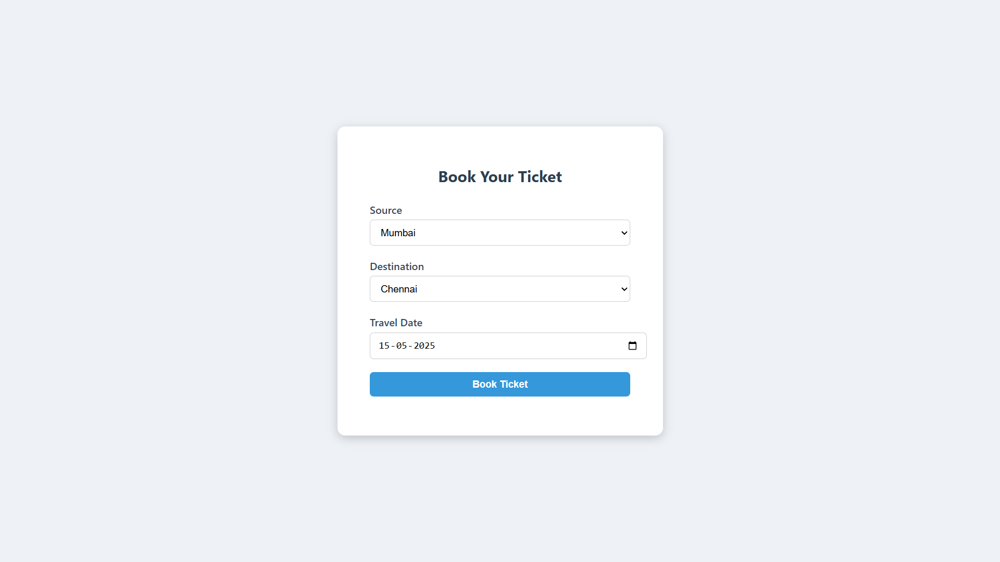
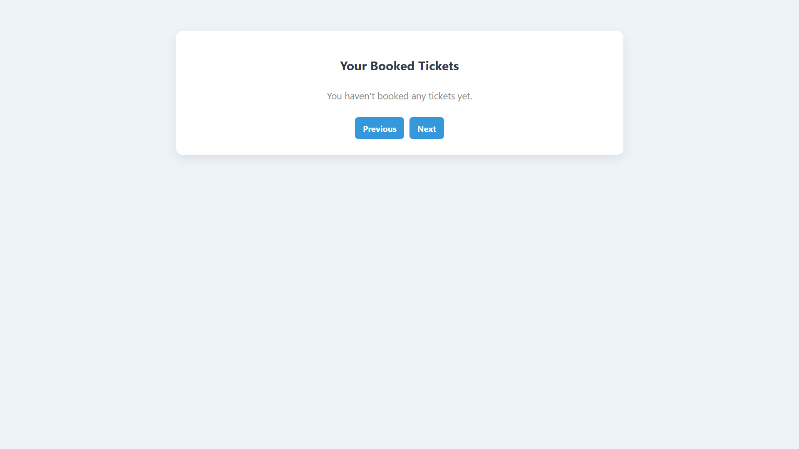
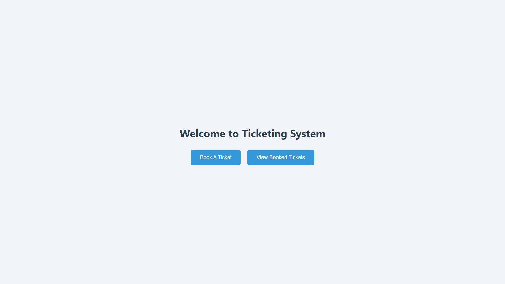
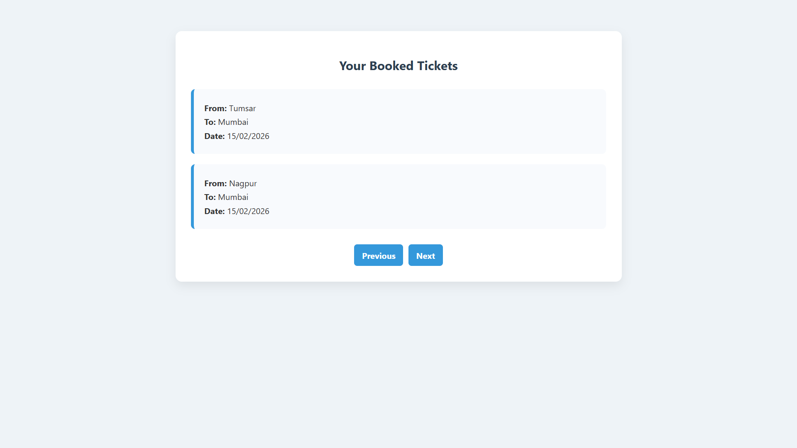

# 🎟️ Ticket Booking System (Spring MVC Project)

A **simple yet robust web application** to demonstrate core concepts of **Spring MVC**, **ORM (Hibernate/JPA)**, **JDBC**, and **JSP**.

This project allows users to **book tickets** and **view their booked tickets** through a clean web interface.

---

## 📌 Features

- 🎫 **Book Ticket** – Submit travel details and save them in the database.
- 📄 **View Tickets** – Fetch and display user-specific ticket records.
- 🛠️ **Spring MVC** architecture for clean separation of concerns.
- 🧩 Uses **JSP** for rendering views with JSTL & EL.
- 🗃️ **ORM** (Hibernate/JPA) or **JDBC** based DAO layer.
- 🔗 RESTful-like GET request for fetching user-specific ticket data.

---

## 🧰 Tech Stack

| Layer             | Technology         |
|------------------|--------------------|
| Backend Framework| Spring MVC         |
| View Layer       | JSP, JSTL, EL      |
| ORM (optional)   | Hibernate / JPA    |
| JDBC Layer       | Spring JDBC        |
| Build Tool       | Maven / Gradle     |
| Server           | Apache Tomcat      |
| Database         | MySQL / H2 / Oracle (configurable) |

---

## 📂 Project Structure

```
src/main/java/ticketing
├── controller/
│   └── TicketController.java
|   └── HomeController.java
|   └── UserController.java
├── services/
│   └── TicketService.java
│   └── TicketServiceImpl.java
│   └── CustomerService.java
│   └── CustomerServiceImpl.java
├── dao/
│   └── TicketDao.java
│   └── TicketDaoImpl.java
│   └── CustomerDao.java
│   └── CustomerDaoImpl.java
├── models/
│   └── TicketRequest.java
│   └── UserRequest.java
├── entities/
│   └── Ticket.java
│   └── Customer.java
├── main/webapp/WEB-INF/views/
│   └── view.jsp
│   └── book.jsp
│   └── home.jsp
│   └── login.jsp
├── main/webapp/WEB-INF
|   └── dispatcher-servlet.xml
|   └── web.xml
```

---

## 🚀 How to Run

1. **Clone the repository**
   ```bash
   git clone https://github.com/Pranay-bohre/Ticketing_System.git
   cd Pranay-bohre/Ticketing_System
   ```

2. **Configure DB credentials**
   Update configuration file with your DB URL, username, and password.

3. **Build the project**
   ```bash
   mvn clean install
   ```

4. **Deploy on Apache Tomcat**
   - Copy the `.war` to Tomcat's `webapps/` folder
   - Start Tomcat

5. **Access the app**
   ```
   http://localhost:8080/ticketing/
   ```

---

## 📸 Screenshots

> Add screenshots of the booking and view ticket pages here for better visual context.

---

## 🧠 Concepts Demonstrated

- ✅ Model-View-Controller pattern using Spring MVC
- ✅ JSP view rendering using JSTL and EL
- ✅ Form handling and request mapping in Spring
- ✅ JDBC template or Hibernate integration for data persistence
- ✅ Clean and modular code structure for real-world readiness

---

## 🙌 Contributing

Have suggestions or improvements? Feel free to open a pull request or issue.

---

## 📝 License

This project is open-sourced under the MIT License. See the [LICENSE](LICENSE) file for details.

---

## 👨‍💻 Author

**Pranay Bohre**  
*Full Stack Developer passionate about scalable backend systems and interactive UI.*

---
```
### 🖥 Book Ticket Page


### 📄 View Tickets Page


### ✅ Booking Success Page


### 📋 View All Tickets Page


